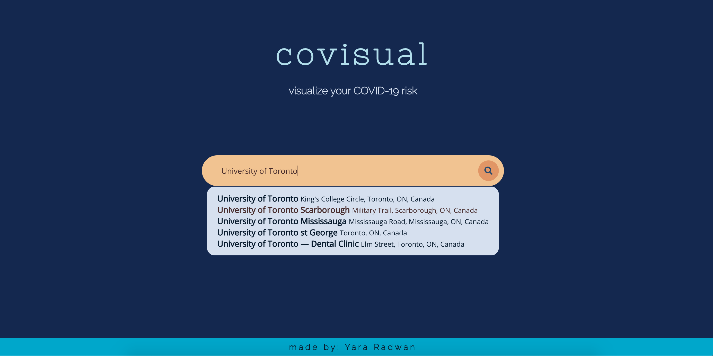

# covisual
visualize your COVID-19 risk

## sneak peak

<i>Landing page, made with React</i>

## Inpiration
I was inspired to make this web-app after grocery shopping with my parents. Once upon a time, my dad and I visited a superstore to buy some on-sale goods. Several days later, we had learned that the particular store we went to had a COVID outbreak, which we fortunately avoided. Though, if we had easily known the number of COVID cases in the area, we surely would have chosen a different place to grocery shop! So, to help Torontonians safely and conciously navigate the city during a dangerous pandemic, I created covisual.

## Navigation
Upon visiting, you will be greeting with a landing page that will prompt you to enter the address of the destination you are heading to. Once you enter your search, you will be directed to a results page, which will provide you with the COVID-19 related statistics (current active cases, sources of COVID-19 contraction, rank among other Toronto neighborhoods) within the area of your provided destination. 

## Technology Stack
covisual is created with:
<ul>
  <li> React (front-end) </li>
  <li> Flask (back-end) </li>
  <li> Google Maps API </li>
  <li> Toronto Open COVID-19 data </li>
</ul>
*special inspo credits to <a href="https://codepen.io/sdaitzman/pen/rmqfB">this template</a> for my search bar design!
